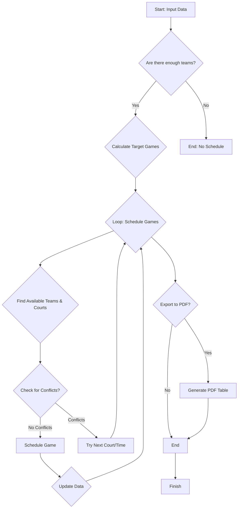

# 📅 Schedule Generator ⚽🏀🏈

This project helps you create awesome schedules for your sports events! 🎉 It's designed to make sure everyone gets to play, courts are used efficiently, and things run smoothly.

## How It Works 🧠

Imagine you're planning a tournament. This tool takes in your list of teams 👥, the times you want to play ⏰, how many courts you have 🏟️, and how many games you want each team to play 🏆.

Then, it magically creates a schedule that:

- Uses all your courts 💯
- Makes sure teams don't play at the same time 🚫⏰
- Gives everyone the right amount of playtime ✅
- Prevents teams from playing each other twice 🙅‍♂️
- Tries to keep teams from playing on the same court back-to-back 🔄🏟️

### The Process ⚙️

Here's a simplified view of how it all comes together:

1.  **Get the Info:** We start by gathering all the details about your event. 📝
2.  **Plan the Games:** The system figures out how many games each team should play. 📊
3.  **Schedule the Matches:** It then goes through each time slot and court, finding the best team pairings. 🤝
4.  **Avoid Clashes:** It makes sure no team plays two games at once and tries to keep them moving between courts. ⏰🏟️
5.  **Create a PDF (Optional):** You can even get a nice-looking PDF schedule with team colors! 🌈📄

### What You Get 🎁

- A well-organized schedule that's fair and efficient. 🏆
- A PDF document with colorful team info. 🎨📄

### Why This Is Awesome 😎

- Saves you time and stress! ⏱️😌
- Makes your event look professional. ✨
- Keeps everyone happy and playing. 😊

Let's make your next sports event a huge success! 🥳
